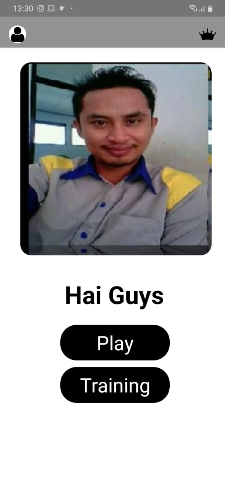
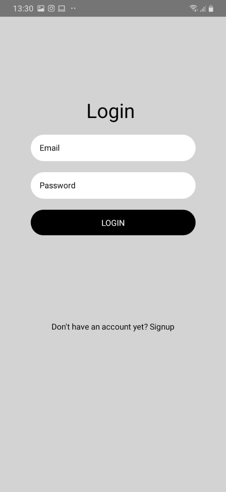
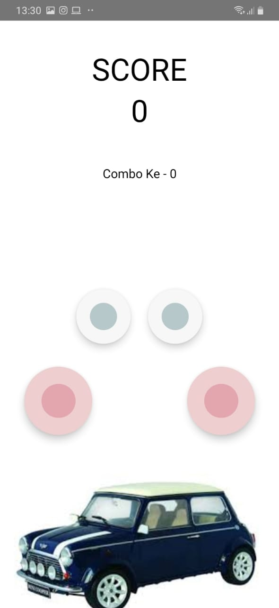
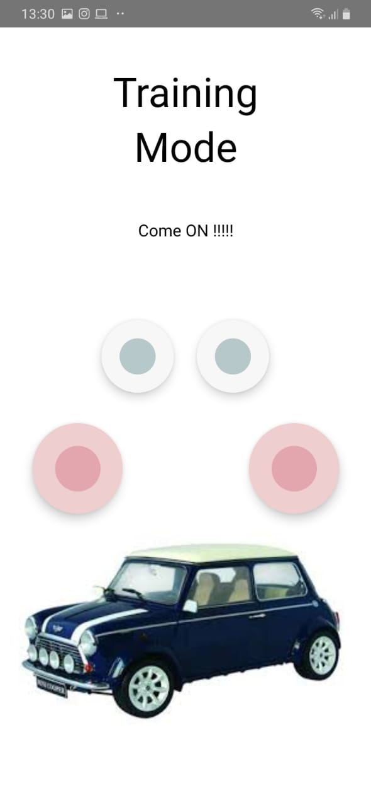

<h1 align="center">Polopad Drum Game</h1>

  

  Built with React Native.

## Table of Contents

- [Introduction](#introduction)
- [Features](#features)
- [Requirements](#requirements)
- [Usage](#usage-for-development)
- [Screenshots](#screenshots)
- [Release APK](#release-apk)
- [Related Project](#related-project-backend)
- [Contributors](#contributors)

## Introduction
<b>Polo Pad</b> is a game where you have to press the drums in accordance with a predetermined pattern if after 3 seconds are passed then you will lose

## Features
* Users must sign in before play a game
* Users can see leaderboard list player
* Users can play game and get best score
* User can traning if bored play the game
* user can register for save the score into leaderboard

## Requirements
* [`npm`](https://www.npmjs.com/get-npm)
* [`react-native`](https://facebook.github.io/react-native/docs/getting-started)
* [`react-native-cli`](https://facebook.github.io/react-native/docs/getting-started)
* [`backEndPolopadGame`](https://github.com/ayiangio/backEndPolopadGame.git)

## Usage for development
1. Open your terminal or command prompt
2. Type `git clone https://github.com/ayiangio/poloPadGame.git`
3. Open the folder and type `npm install` for install dependencies and `react-native link`
4. Before run this, you must run backend first
5. Type `react-native run-android` for run this app. ***Make sure your device is connected with debugging mode***.

## Screenshots

        
    
    
    

## Release APK

## Related Project (Backend)
* [`backEndPolopadGame`](https://github.com/ayiangio/backEndPolopadGame)

## Contributors

  <table>
    <tr>
      <td align="center">
        <a href="https://github.com/ayiangio">
           
          <b>Ayi Angio</b>
        </a>
      </td>
    </tr>
  </table>

